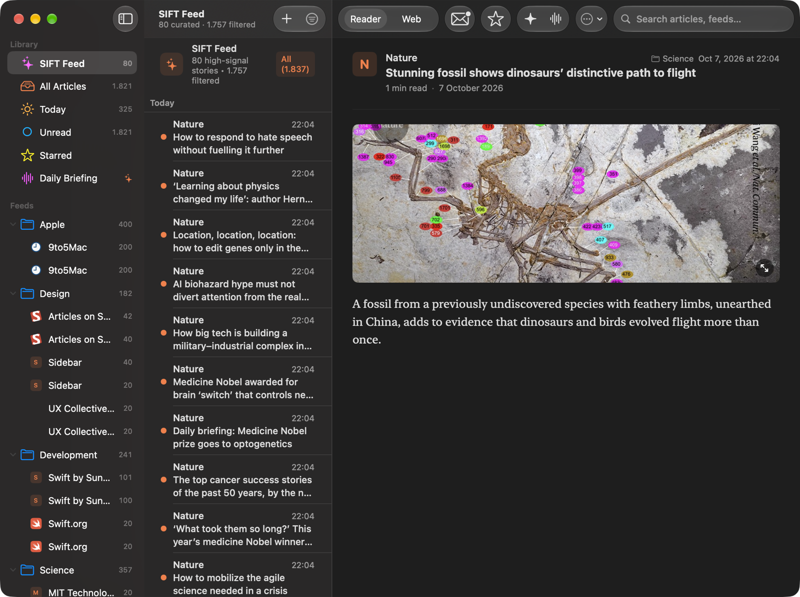
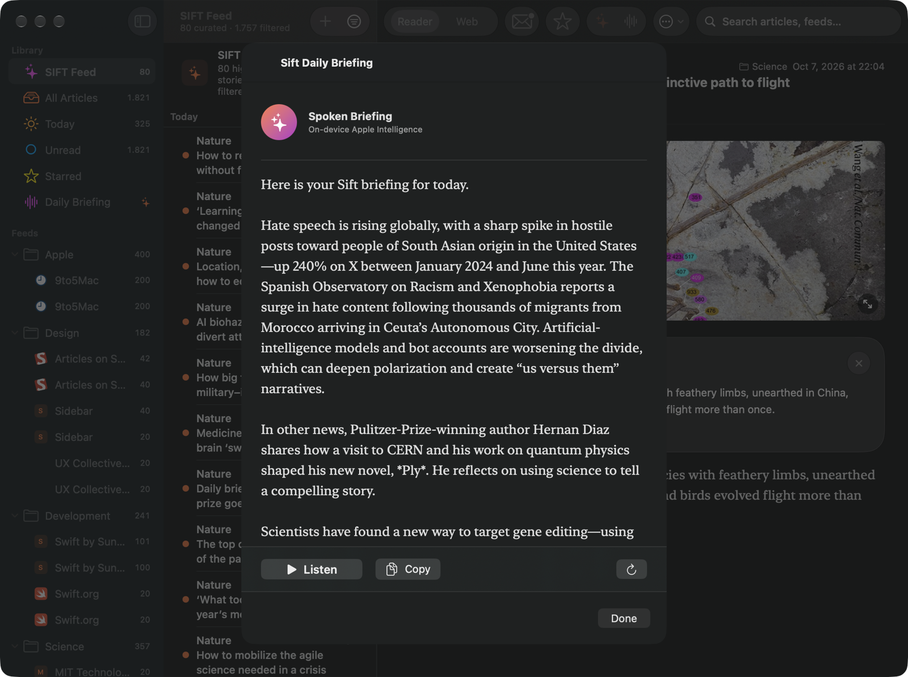
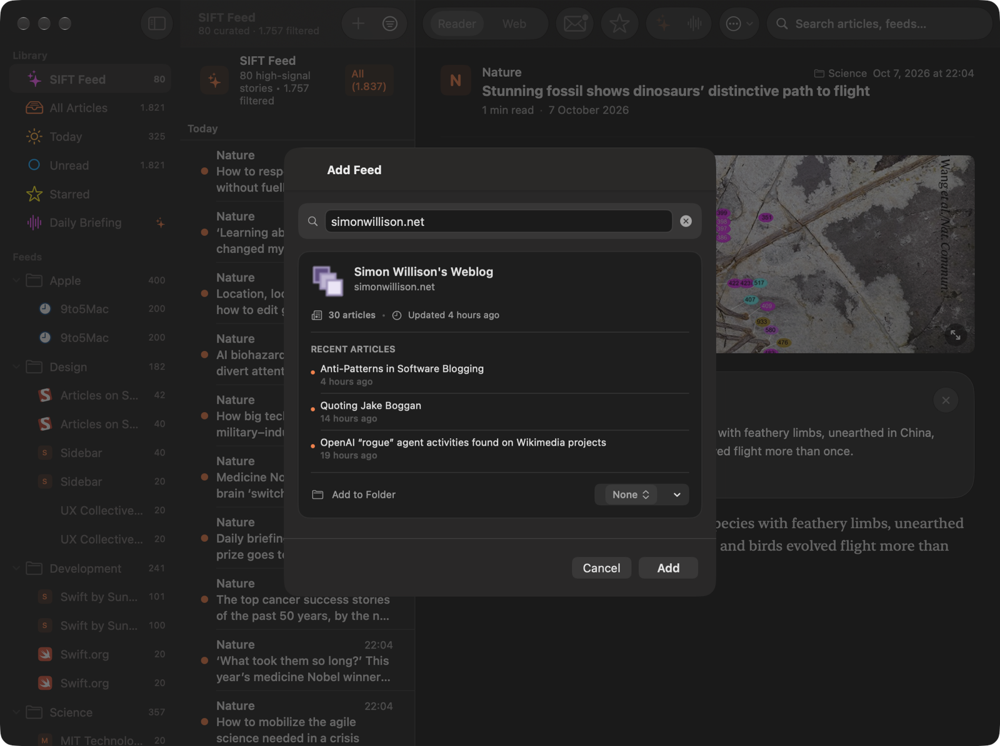
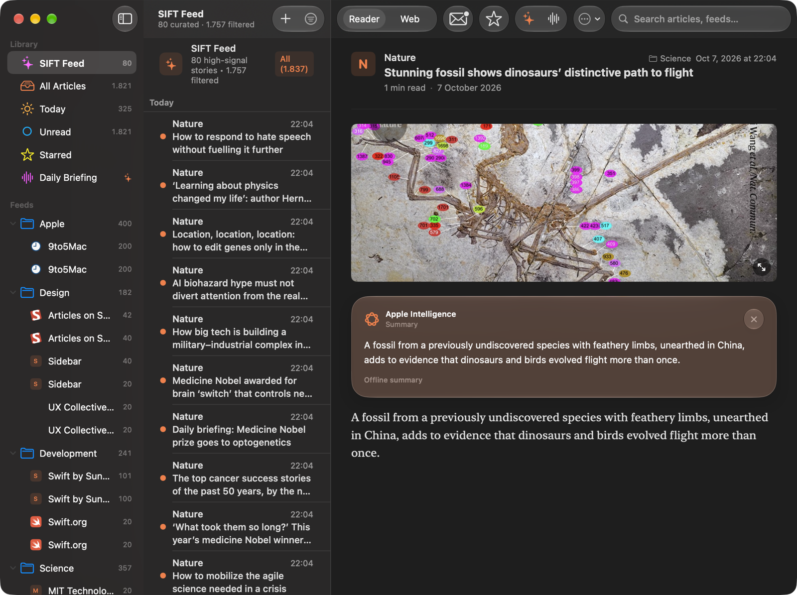
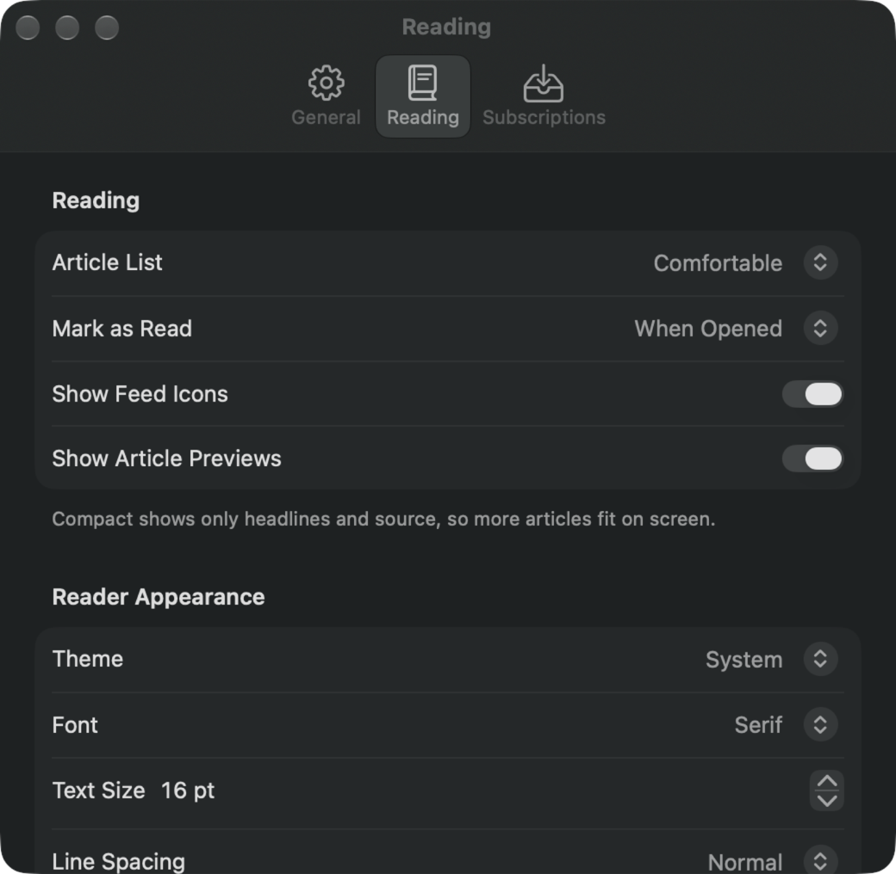
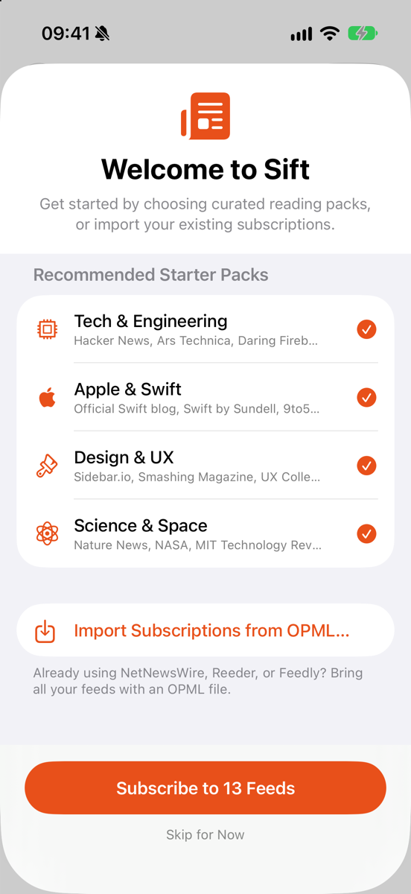
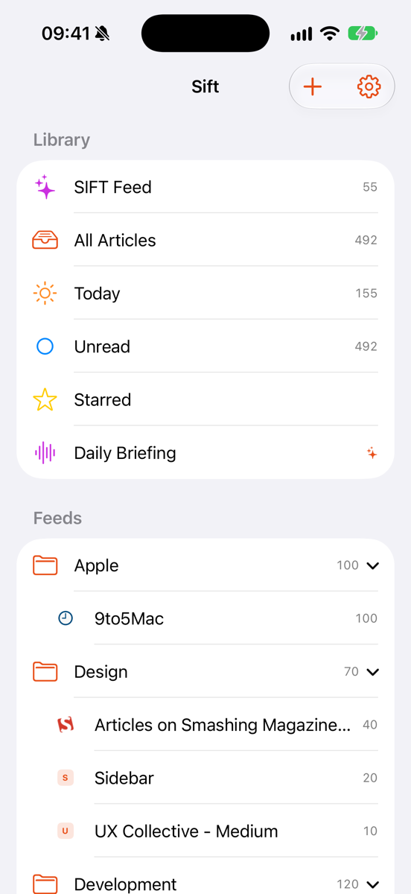
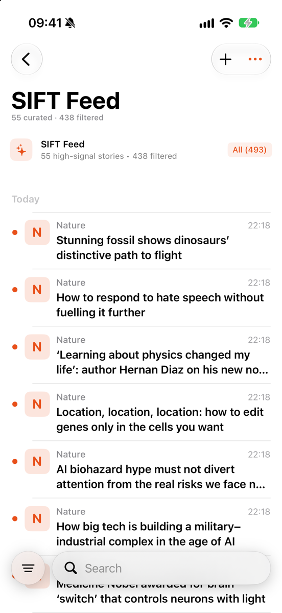

<div align="center">


# Sift

**A calm, native RSS reader for macOS and iOS that filters the noise and briefs you on what matters — entirely on-device.**

[](#requirements)
[](#requirements)
[](https://developer.apple.com/xcode/swiftui/)
[](https://developer.apple.com/xcode/swiftdata/)
[](https://developer.apple.com/documentation/foundationmodels)
[](LICENSE)

[Features](#features) · [Screenshots](#screenshots) · [Getting started](#getting-started) · [Architecture](#architecture) · [Privacy](#privacy) · [Roadmap](#roadmap)

<br>



</div>

---

## Why Sift?

Most RSS readers hand you an unread counter that only grows. Sift takes the opposite stance:

- **Curate, don't hoard.** The **SIFT Feed** ranks your subscriptions, collapses near-duplicate stories, balances sources and hides low-signal posts — so you read the 50 stories that matter instead of the 1,800 that arrived.
- **Brief, don't scroll.** A **Daily Briefing** written by Apple's on-device language model summarizes your top unread stories, and can read them aloud.
- **Native, private, local.** SwiftUI and SwiftData on Apple platforms, no account, no server, no analytics. Every model request stays on your device.

---

## Features

### Reading
| | |
|---|---|
| **Adaptive layout** | Three-column window on macOS that collapses to two or one column as the window narrows; navigation stack on iPhone. |
| **SIFT Feed** | A curated view that scores articles, removes duplicates and near-duplicates, balances sources and favors fresh stories. Mark any feed as **VIP** to always boost it. |
| **Smart library** | SIFT Feed, All Articles, Today, Unread and Starred — each with live counts — plus feeds grouped into collapsible folders. |
| **Reader & Web modes** | A distraction-free reader with full-text extraction, reading progress and estimated reading time, or the original page in an embedded web view. |
| **Reader appearance** | Themes (System, Paper, Sepia, Night), fonts (System, Serif, Monospace), 12–28 pt text, line spacing, column width and list density. |
| **Image lightbox** | Tap any article image to view it full size. |
| **Filters & search** | Search across articles and feeds; filter by unread, starred, today, media or VIP feeds, or exclude individual feeds. |
| **Bulk actions with undo** | Mark everything as read with a confirmation and a 5-second undo. |

### On-device intelligence
| | |
|---|---|
| **Article summaries** | Per-article summary, key points and topics generated with Apple's [Foundation Models](https://developer.apple.com/documentation/foundationmodels) framework and cached locally. Falls back to an extractive summary when Apple Intelligence is unavailable. |
| **Daily Briefing** | A spoken-style briefing of your top unread stories with **Listen**, **Copy** and **Regenerate**. |
| **Listen to articles** | Built-in text-to-speech for any article or the briefing. |
| **On-device translation** | Foreign-language titles and articles are translated with Apple's Translation framework while keeping the original. |
| **Stories** *(preview)* | Experimental clustering that groups coverage of the same event across sources. |

### Feeds & data
| | |
|---|---|
| **Feed discovery** | Paste any website address — Sift finds its RSS/Atom feeds, lets you pick one, and shows a live preview of recent articles before you subscribe. |
| **Starter packs** | Onboarding with curated packs: Tech & Engineering, Apple & Swift, Design & UX, Science & Space. |
| **OPML import & export** | Bring subscriptions from NetNewsWire, Reeder or Feedly; open `.opml` files directly from Finder. |
| **Background refresh** | Configurable refresh interval (5–60 min or manual) using native scheduling on macOS and `BGAppRefreshTask` on iOS. Optional launch at login. |
| **Retention** | Choose how long read articles are kept, or clean up on demand. |

### System integration
| | |
|---|---|
| **Widgets** | "Recent Articles" widget in small, medium, large and extra-large sizes with deep links into the app, plus an **Open Sift** control. |
| **Siri & Shortcuts** | *"Read my Sift briefing"*, *"What's new in Sift?"*, *"Summarize latest article in Sift"*, and a **Summarize Article** action for Shortcuts. |
| **Menu bar extra** (macOS) | Unread count and the latest unread headlines one click away. |
| **Notifications** | Optional alerts for new high-signal articles; click to jump straight to the story. |
| **Dock badge** | Unread count on the app icon. |
| **Deep links** | `sift://` and `rssreader://` URLs for feeds and articles. |

### Keyboard shortcuts (macOS)

| Key | Action |
|---|---|
| <kbd>J</kbd> / <kbd>K</kbd> | Next / previous article |
| <kbd>M</kbd> | Toggle read |
| <kbd>S</kbd> | Toggle star |
| <kbd>O</kbd> | Open the original article in the browser |
| <kbd>⌘</kbd><kbd>R</kbd> | Refresh all feeds |
| <kbd>⇧</kbd><kbd>⌘</kbd><kbd>R</kbd> | Mark all as read |
| <kbd>⌘</kbd><kbd>,</kbd> | Settings |
| <kbd>Esc</kbd> | Close the image lightbox |

---

## Screenshots

### macOS

<table>
  <tr>
    <td width="50%"></td>
    <td width="50%"></td>
  </tr>
  <tr>
    <td align="center"><b>Daily Briefing</b> — written on-device by Apple Intelligence</td>
    <td align="center"><b>Add Feed</b> — paste a site, get a live preview</td>
  </tr>
  <tr>
    <td width="50%"></td>
    <td width="50%"></td>
  </tr>
  <tr>
    <td align="center"><b>Article summary</b> — inline, cached, private</td>
    <td align="center"><b>Reading settings</b> — themes, fonts, density</td>
  </tr>
</table>

### iPhone

<table>
  <tr>
    <td width="25%"></td>
    <td width="25%"></td>
    <td width="25%"></td>
    <td width="25%"></td>
  </tr>
  <tr>
    <td align="center"><b>Onboarding</b></td>
    <td align="center"><b>Library</b></td>
    <td align="center"><b>SIFT Feed</b></td>
    <td align="center"><b>Reader</b></td>
  </tr>
</table>

---

## Getting started

### Requirements

| | Minimum |
|---|---|
| macOS | 26.6 |
| iOS / iPadOS | 26.6 |
| Xcode | 27 used for local verification; the project uses object version 90. Older Xcode compatibility has not been verified. |
| Apple Intelligence | Optional — needed for generated summaries and briefings; Sift falls back to extractive summaries without it |

### Build & run

```bash
git clone https://github.com/Zaryob/Sift.git
cd Sift
open Sift.xcodeproj
```

1. Select the **Sift** scheme and a destination (**My Mac** or an iOS simulator).
2. In *Signing & Capabilities*, choose your own development team for both the **Sift** and **SiftWidgetExtension** targets. The app and widget share data through the App Group `group.io.github.zaryob.sift`; change the bundle identifiers and group if you sign with a different team.
3. Press <kbd>⌘</kbd><kbd>R</kbd>.

The app and widget App Group entitlements are versioned. Xcode's target settings enable the macOS app sandbox and outgoing network connections. Provisioning and App Group registration still require your development team; an unsigned build does not verify them.

From the command line:

```bash
xcodebuild -project Sift.xcodeproj -scheme Sift -destination 'platform=macOS' CODE_SIGNING_ALLOWED=NO build
```

### Running the tests

```bash
xcodebuild -project Sift.xcodeproj -scheme Sift -destination 'platform=macOS' test
```

The `SiftTests` target covers the feed parser, OPML service, feed discovery, refresh service, SmartFeedFilter ranking, data pruning, deep-link routing, favicons and story clustering, Several suites use in-memory SwiftData stores and a mocked HTTP client. Run hosted tests in an isolated simulator; this is not a guarantee that the entire app host performs no network or persistence work.

The `SiftTests` folder is attached to the test target. Use a development signature to run hosted macOS tests; the unsigned build above is only a compilation check. [Local verification](docs/VALIDATION.md) records actual test results, remaining failures and release limitations.

---

## Architecture

```
Sift/
├── SiftApp.swift              App entry, scenes (main window, Settings, menu bar extra)
├── ContentView.swift          Adaptive split view and onboarding gate
├── AppViewModel.swift         App-level coordination: navigation, subscriptions, deep links
├── Features/                  SwiftUI feature modules
│   ├── ArticleList/           Article list, filters, Stories preview
│   ├── ArticleDetail/         Reader, web view, speaker, image lightbox
│   ├── Briefing/              Daily Briefing sheet
│   ├── FeedList/              Sidebar, Add Feed sheet, menu bar extra
│   ├── Onboarding/            Starter packs and OPML onboarding
│   └── Settings/              General · Reading · Subscriptions
├── FeedEngine/                FeedRefreshService (actor): fetch → parse → merge → notify
├── Networking/                Conditional-GET HTTP client, feed auto-discovery
├── Parsing/                   XMLParser-based RSS 2.0 / Atom / RDF parser
├── Persistence/               SwiftData container and retention/pruning
├── Background/                Background refresh, notifications, login item
├── Clustering/                Experimental multi-source story clustering
├── Models/                    Feed, FeedItem, IntelligenceResult (@Model)
└── Shared/                    Intelligence, extraction, OPML, ranking, widgets, intents
SiftWidget/                    WidgetKit extension and Control widget
SiftTests/                     XCTest suite
tools/                         Research tooling for story-clustering evaluation
docs/                          Architecture, data flow and research notes
```

**Data flow.** `FeedRefreshService` fetches feeds concurrently with conditional GET (`ETag` / `Last-Modified`), parses them with `FeedParser`, merges new items into SwiftData, then updates notifications, the Dock badge and the widget snapshot. `ArticleEnrichmentQueue` extracts full text and generates on-device digests in the background; `SmartFeedFilter` ranks the SIFT Feed from those signals.

| Layer | Technology |
|---|---|
| UI | SwiftUI, AppKit / UIKit bridges, WebKit |
| State | Observation (`@Observable`), Combine |
| Persistence | SwiftData, App Group container |
| Networking | `URLSession` with conditional requests |
| Intelligence | FoundationModels, NaturalLanguage, Translation, AVFoundation (speech) |
| System | WidgetKit, AppIntents, UserNotifications, BackgroundTasks, ServiceManagement |

More detail: [`docs/ARCHITECTURE.md`](docs/ARCHITECTURE.md) · [`docs/DATA_FLOW.md`](docs/DATA_FLOW.md) · [`docs/STORY_CLUSTERING_ARCHITECTURE.md`](docs/STORY_CLUSTERING_ARCHITECTURE.md)

---

## Privacy

- **No accounts, no servers, no analytics, no third-party SDKs.**
- All AI features run on-device through Apple's Foundation Models framework. Sift never uses Private Cloud Compute or any remote model.
- Network requests go only to the feeds you subscribe to, the publisher pages of their articles (for full-text extraction) and those sites' icons.
- Your library lives in a local SwiftData store shared only with Sift's own widget through an App Group.

---

## Localization

Sift uses String Catalogs. English is the source language; **Turkish**, **German** and **French** translations are in progress.

| Language | Coverage |
|---|---|
| English | 100% |
| Deutsch | ~19% |
| Français | ~19% |
| Türkçe | ~15% |

Contributions to translations are very welcome — edit `Sift/Localizable.xcstrings` in Xcode.

---

## Roadmap

The project is under active development. A detailed engineering review with prioritized fixes lives in [`docs/CRITIQUE.md`](docs/CRITIQUE.md); product direction is in [`docs/SIFT_PRODUCT_ROADMAP.md`](docs/SIFT_PRODUCT_ROADMAP.md).

**Next up**
- [x] Attach the test suite to the test target (local results in `docs/VALIDATION.md`; CI is optional)
- [ ] Parser: namespaced elements (`content:encoded`, `dc:*`, `media:*`), HTML entities, relative URLs
- [ ] Non-destructive promotional filtering and a typed settings store
- [ ] Unique constraints, tombstones and a single refresh coordinator to prevent duplicates
- [ ] Swift 6 language mode with database work on `@ModelActor`
- [ ] Full macOS menu commands (File, View, Article) and feed inspector
- [ ] Complete Turkish, German and French translations

---

## Contributing

Issues and pull requests are welcome. Before opening a PR:

1. Build both the **Sift** and **SiftWidgetExtension** targets for macOS and iOS.
2. Run the test suite and add tests for parser, ranking or persistence changes.
3. Keep user-facing strings in `Localizable.xcstrings`.
4. Write commit messages in English, in the imperative mood (*"Fix duplicate items on concurrent refresh"*).

---

## License

Sift is released under the [MIT License](LICENSE).
