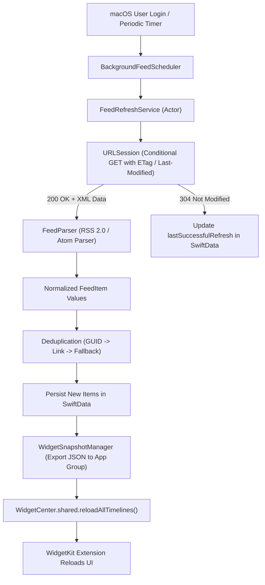
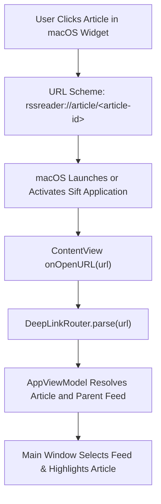
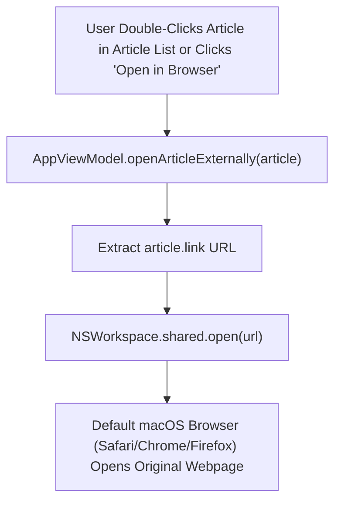
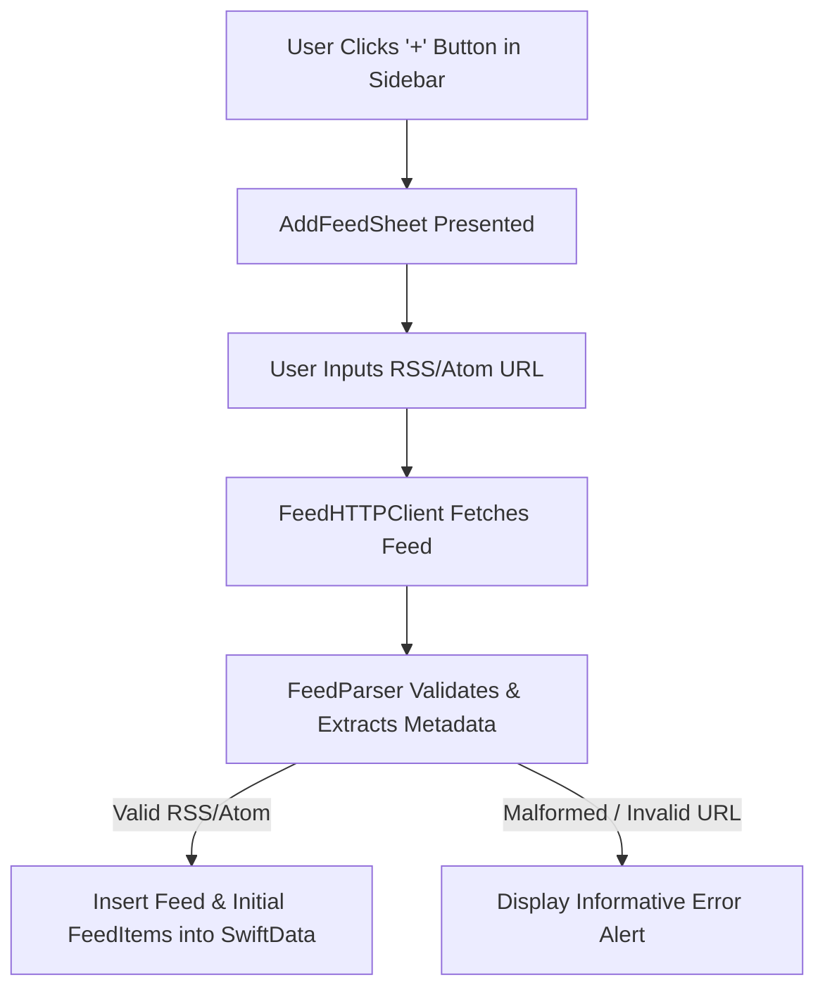

# Sift Data Flow Documentation

This document describes the key end-to-end data flows within Sift.

## 1. Background Feed Synchronization Flow

## 2. Widget Interaction & Deep Link Flow

## 3. External Article Reading Flow

## 4. Add Feed User Flow

