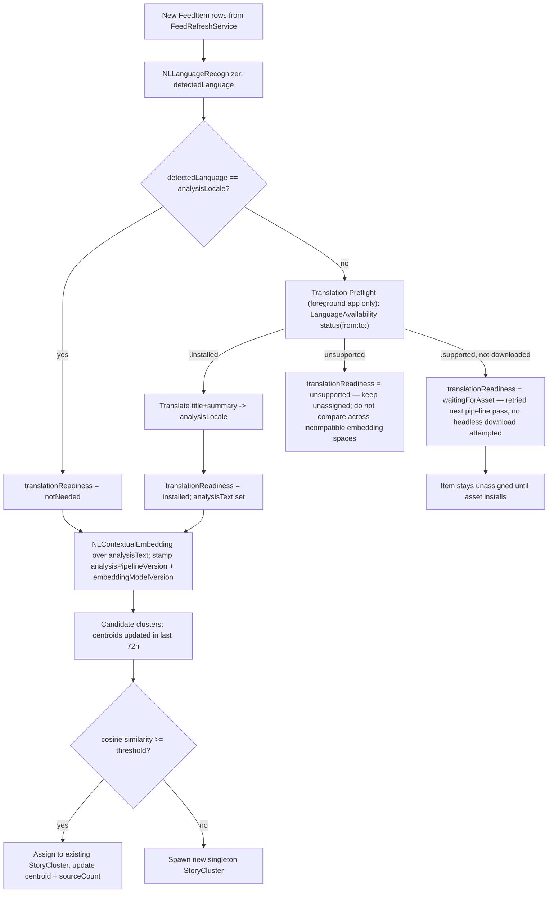

# Sift Story Clustering Architecture (Design Draft v0.2)

**Status:** Product direction and phased roadmap are approved. This clustering
design remains gated: story-primary UI and user-facing summaries do not ship until
the M0 evidence gate passes. See [`SIFT_PRODUCT_ROADMAP.md`](SIFT_PRODUCT_ROADMAP.md)
for the shared product contract, full milestones, behavioral personalization,
briefings, notifications, and release criteria. This document owns the clustering
data model and pipeline details; it extends `ARCHITECTURE.md` and `DATA_FLOW.md`.

**Scope.** This document specifies how ingested `FeedItem`s become source-linked
`StoryCluster`s. The product also includes conventional RSS reading, optional Apple
on-device synthesis, personalized morning/evening briefings, and separately gated
urgent notifications; those experiences are governed by the product roadmap. A
cluster's recency and coverage signals are inputs to those experiences, not proof
that publishers independently corroborate a claim.

## 0. Core Premise

The product's core story entity is **`StoryCluster`**, not `FeedItem`. `FeedItem` remains
the raw, effectively immutable ingestion unit (one row per publisher's article,
produced exactly as today by `FeedParser` + `FeedRefreshService`), but it is no
longer the primary thing a user reads. A `StoryCluster` groups the `FeedItem`s —
possibly from different feeds and different languages — that report the same
underlying story; Story mode uses it as the unit of navigation while By Feed keeps
`FeedItem` as the unit of reading.

Story mode presents "stories, each with sources" while By Feed mode preserves the
existing "feeds, each with items" experience. Story mode remains gated on M0; RSS
reading and feed management stay available on devices without Apple Intelligence.

## 1. Domain Model

Two additions to the existing SwiftData schema (`Feed`, `FeedItem` in
`Sift/Models/`), plus new fields on both.

```swift
@Model
public final class StoryCluster {
    @Attribute(.unique) public var id: UUID
    public var canonicalTitle: String        // copied from representativeItem.title verbatim — never translated
    public var summary: String?              // extractive, picked from the member nearest the centroid
    public var firstSeenDate: Date
    public var lastUpdatedDate: Date
    public var sourceCount: Int              // distinct publishers among current members — recomputed on every membership change, not time-dependent
    public var languages: [String]           // BCP-47 tags observed among members
    public var centroid: [Float]             // running mean embedding, in analysis-locale space
    public var representativeItem: FeedItem?  // drives display title/artwork/primary link

    @Relationship(deleteRule: .nullify, inverse: \FeedItem.storyCluster)
    public var members: [FeedItem]
}
```

New `FeedItem` fields:

```swift
public var storyCluster: StoryCluster?
public var detectedLanguage: String?           // BCP-47, from NLLanguageRecognizer
public var analysisText: String?               // title+summary translated into the pivot locale — internal only, never rendered
public var embedding: [Float]?
public var clusterAssignmentAttemptedAt: Date?

// Derived-data provenance — required to know which rows must be recomputed
// when the pipeline changes (see §5, M3).
public var analysisLocale: String?             // pivot locale actually used for this item, recorded per-row since the global default can change over time
public var analysisPipelineVersion: Int?
public var embeddingModelVersion: Int?
public var translationReadiness: TranslationReadiness?
```

```swift
public enum TranslationReadiness: String, Codable {
    case notNeeded        // detectedLanguage == analysisLocale, no translation required
    case installed        // pairing was ready; analysisText was produced
    case waitingForAsset  // pairing is supported but the on-device model isn't downloaded yet
    case unsupported      // pairing is not supported — article remains unassigned
}
```

New `Feed` field:

```swift
public var publisherKey: String   // registrable domain of siteURL (fallback: url host), e.g. "arstechnica.com" — used to count distinct *publishers*, not distinct feeds, when several feeds (News/Tech/Breaking) come from the same site
```

### Fix: deletion semantics (was `.cascade`, is now `.nullify`)

`StoryCluster.members` must **not** cascade-delete. A `StoryCluster` is a derived,
disposable grouping — it can be deleted and rebuilt at will (pipeline version bump,
bad-cluster cleanup, etc.) and that must never take the underlying raw `FeedItem`
rows with it. `.nullify` means deleting a `StoryCluster` only clears
`FeedItem.storyCluster` back to `nil`, leaving the ingested article intact and
eligible for reassignment on the next pipeline pass. `Feed`'s existing `.cascade`
toward its own `FeedItem`s is unrelated and unchanged — deleting a feed the user
removed should still delete its articles.

### Migration note

`PersistenceController` currently builds `Schema([Feed.self, FeedItem.self])` with no
versioned migration plan. Adding `StoryCluster`, the new `FeedItem` fields, and
`Feed.publisherKey` is the first schema change this project has needed — M1 must
introduce a `SchemaMigrationPlan` (lightweight migration is sufficient; all new
fields are optional/defaulted) rather than relying on SwiftData's implicit
best-effort migration, since that's the only path that's inspectable and testable.

### UI note

`ArticleListView` becomes StoryCluster-primary (one row per story, expandable to its
member sources). The existing per-feed list is kept as a "By Feed" view for users who
disable clustering or want the old behavior — this is a toggle, not a removed
capability.

## 2. Clustering Pipeline

Runs as an actor (same shape as `FeedRefreshService`), invoked after every ingestion
batch — from the foreground app, from the iOS `BGAppRefreshTask` handler, and from
`SiftAgent.app` (§3).



Key decisions:

- **Common analysis locale (M0 hypothesis).** Every `FeedItem`, regardless of source
  language, may be normalized into one pivot language before embedding. The v0
  candidate is English, but M0 must validate translation coverage and quality for
  the target languages before this becomes a shipped default. Embedding spaces
  are not reliably aligned across languages, and simple lexical signals (shared named
  entities, TF-IDF overlap) that we want as a cheap first-pass filter only work when
  both sides are in the same language. `analysisText` is stored separately from
  `title`/`summary` precisely so translation quality never touches what the user
  reads.
- **Unsupported language pairs stay unassigned.** Do not embed raw text from an
  unsupported translation pair into a pivot-locale cluster: that mixes embedding
  spaces and can create silent false matches. Preserve the source article and retry
  only after a supported on-device path is available.
  **Translation asset provisioning is a foreground-only concern (fix 3).**
  Apple's Translation framework distinguishes a language pair being *supported*
  from actually being *installed* on-device; installing an uninstalled pairing can
  require user-facing download consent. `SiftAgent.app` runs headless and must never
  attempt to trigger that UI. Instead, the main app runs a **Translation Preflight**
  step whenever it's foregrounded: it looks at the languages actually seen across the
  user's feeds, diffs them against `analysisLocale`, and — while the user is present
  — prepares/downloads the needed pairings. `SiftAgent.app` only ever consumes items
  already `.installed`; anything still `.waitingForAsset` is simply retried on the
  next pipeline pass rather than blocking or erroring.
- **Bounded candidate set.** New items are only compared against clusters updated in
  the last 72h, not the full corpus — keeps assignment O(recent clusters), not
  O(history).
- **Centroid drift control.** Centroid is a running mean weighted toward recent
  members (or recomputed from the top-K freshest members) so a cluster doesn't
  ossify around its oldest items.
- **Distinct-publisher counting, not distinct-feed counting (fix 5b).** `sourceCount`
  counts distinct `Feed.publisherKey` values among current members, not distinct
  `Feed.id`s — three feeds from the same outlet (News/Technology/Breaking) must not
  look like three independent corroborating sources.
- **Derived-data versioning (fix 6).** `analysisLocale`, `analysisPipelineVersion`,
  and `embeddingModelVersion` are stamped on every `FeedItem` when its
  `analysisText`/`embedding` are computed. This is the only reliable way to know,
  after a threshold/model/pivot change, exactly which rows are stale and need
  reclustering rather than reprocessing the entire corpus blindly.
- **Clustering does not author the briefing.** This subsystem may expose an
  extractive representative sentence for diagnostics or a non-generative fallback.
  Apple on-device synthesis and source-linked claims are governed by
  [`SIFT_PRODUCT_ROADMAP.md`](SIFT_PRODUCT_ROADMAP.md) and must pass M2's gate.

### The "briefing-worthy" signal is computed, not stored (fix 5a)

Whether a cluster currently qualifies as notable (e.g. "≥2 distinct publishers within
a rolling recency window") is **time-dependent** — it can flip from true to false
purely because a clock advanced, with no write to the row. Persisting it as a stored
`Bool` on `StoryCluster` would silently go stale. This subsystem therefore does not
store an `isBriefingWorthy` field at all; it exposes `sourceCount`, `languages`, and
timestamps, and leaves the recency-windowed "is this notable right now" query to
whatever consumes the cluster (a `BriefingPlanner` or similar, computed at query
time). Its product behavior and scheduling contract are defined in
[`SIFT_PRODUCT_ROADMAP.md`](SIFT_PRODUCT_ROADMAP.md).

## 3. Background Execution: SiftAgent.app via `SMAppService.loginItem`

Today's background story is two overlapping, partly-redundant mechanisms:

- `LoginItemManager` — `SMAppService.mainApp`, toggles whether *Sift.app itself*
  relaunches at login. Still valid, unrelated to background refresh.
- `LaunchAgentManager` — hand-writes a `launchd` plist to `~/Library/LaunchAgents`
  and shells out to `launchctl load/unload` to run `Sift --background-refresh`
  periodically. Fragile: manual plist bookkeeping, shells out to a CLI tool, doesn't
  track status other than file-existence, and doesn't play well with sandboxing or
  notarization changes over time.

**Point 1 change:** introduce a real second bundle, `SiftAgent.app`, embedded at
`Sift.app/Contents/Library/LoginItems/SiftAgent.app` with its own bundle identifier
(e.g. `io.github.zaryob.sift.Agent`) and `LSUIElement = true` (no Dock icon).

Registered as:

```swift
if #available(macOS 13.0, *) {
    let service = SMAppService.loginItem(identifier: "io.github.zaryob.sift.Agent")
    try service.register()
}
```

### Fix: resolving the scheduling contradiction (fix 2)

`SMAppService.loginItem` registers exactly that — a login item. It gives no
`StartInterval`-style periodic scheduling contract the way a real `launchd` agent
plist does; Apple treats `.loginItem` and `.agent(plistName:)` as distinct service
types with distinct guarantees. Since point 1 fixes `SiftAgent` as an `.app` bundle
(not a plist-only helper), the correct model is a **resident `LSUIElement` helper**,
not a fire-once-and-exit task and not a `launchd`-interval-scheduled process:

- `SiftAgent.app` launches at login and **stays resident** — it does not idle-exit
  after one run.
- It owns its own in-process scheduler: the same bounded `Task` + `Task.sleep` loop
  pattern `BackgroundFeedScheduler` already uses for its in-app timer, running
  ingestion + the clustering pipeline on an interval.
- It observes `NSWorkspace` sleep/wake notifications to suspend its timer during
  system sleep and run an immediate refresh on wake, rather than trying to catch up
  missed intervals.
- **Accepted limitation:** a login item has no `KeepAlive`/crash-restart semantics
  the way a `launchd` agent would. If `SiftAgent.app` is force-quit or crashes, it
  will not restart until the next login. This is a deliberate tradeoff of staying on
  `.loginItem` per point 1, not an oversight — recorded as an accepted risk in §6
  rather than solved by falling back to `SMAppService.agent(plistName:)`.

Its job once running: open the shared SwiftData store through the existing
`group.io.github.zaryob.sift` App Group container, run ingestion + the clustering
pipeline headlessly (using only `.installed` translation pairings, per §2), refresh
`WidgetSnapshotManager`'s JSON snapshot, and post notifications for cluster changes a
downstream consumer flags as relevant.

Status is observable via `service.status` (`.enabled` / `.requiresApproval` /
`.notFound`) instead of inferred from file existence; `.requiresApproval` should
drive a prompt to open System Settings via `SMAppService.openSystemSettingsLoginItems()`.

This fully replaces `LaunchAgentManager` (delete the manual plist writer and the
`launchctl` `Process` shell-outs). `LoginItemManager`'s `.mainApp` toggle is unrelated
and stays as-is — it controls whether the main UI app opens at login, a separate user
preference from whether the background agent runs.

## 4. Cross-Document Principle Carried Forward

This subsystem does not schedule or deliver anything to the user directly, but any
future consumer of `StoryCluster`/`sourceCount` — a briefing, a notification, a
digest — must treat delivery as **best-effort, never exact-time**, the same way
`BackgroundFeedScheduler`'s existing `BGAppRefreshTaskRequest` usage already is (it
only ever sets `earliestBeginDate` as a floor, never a promise). The full scheduling
and notification contract for the downstream product is defined in
[`SIFT_PRODUCT_ROADMAP.md`](SIFT_PRODUCT_ROADMAP.md).

## 5. Claim disagreements and source diversity

Story identity is separate from claim agreement. Articles can belong to the same
event cluster while using different frames; related developments can share an
`issueID` timeline while remaining separate event clusters. A cluster's `sourceCount`
measures distinct publishers, not independent corroboration or truth.

Briefing synthesis must preserve each material claim's speaker, article, timestamp,
and source link. Compare claims only after checking that they address the same
subject, proposition, time, and scope. Separate direct conflict candidates from
different-scope but compatible claims, updates, allegation/response pairs,
framing differences, syndicated repeats, and insufficient evidence. Foundation
Models may identify and summarize these relationships locally; they do not decide
which outlet or claim is true. When the relationship is unclear, show the source
articles without declaring a conflict. If Apple Intelligence is unavailable, keep
the cluster and source list usable and omit generated synthesis.

The annotation taxonomy and product treatment are specified in
[`SOURCE_CONFLICT_ANNOTATION.md`](SOURCE_CONFLICT_ANNOTATION.md). The active local
silver example is intentionally ignored by Git; never commit its feed records or
source text.

## 6. Milestones

| # | Milestone | Exit Criteria |
|---|---|---|
| **M0** | **Blocking evidence and feasibility gate** — blocks story-primary UI, synthesis, briefings, and urgent alerts. | The current native spike (`Sift/Clustering/StoryClusteringSpike.swift`) runs language detection → installed-asset Translation preflight → on-device embedding → sliding-window clustering without changing shipped data or UI. Run it against a hand-collected corpus of 300–500 real articles from ≥20 publishers and ≥3 languages, manually labeled under [`STORY_CLUSTERING_ANNOTATION_GUIDE.md`](STORY_CLUSTERING_ANNOTATION_GUIDE.md). Evaluate with [`tools/evaluate_story_clusters.py`](../tools/evaluate_story_clusters.py). **Metrics:** pairwise precision/recall/F1; false-merge rate = contaminated predicted clusters / all predicted clusters; false-positive pair rate and false splits reported separately. Record a numeric false-merge bound before scoring. **Go/no-go:** pairwise F1 ≥ 0.75, false-merge rate below that bound, acceptable per-item latency on representative devices, and required translation pairs actually `.installed`. Measure `lowLatency` and `highFidelity` separately. User sessions and a one-week diary are also required by the roadmap; repository code does not substitute for those evidence. If a gate fails, revise the on-device strategy and rerun M0 before moving forward. |
| **M1–M4** | Product delivery milestones | Defined by [`SIFT_PRODUCT_ROADMAP.md`](SIFT_PRODUCT_ROADMAP.md), the product source of truth. M1 adds durable story pipeline after M0; M2 adds story/synthesis; M3 adds briefing and notification policy; M4 pilots and iterates. Keep technical schema and migration details in this architecture document. |

## 7. Non-Goals and Accepted Risks for v0

- Cross-publisher fact-checking or claims that source count proves truth.
- User-facing cluster correction before benchmark quality is established. When
  correction UI ships, corrections must be durable and included in later evaluation.
- Server-side/cloud clustering, synthesis, or preference learning. If M0 fails,
  revisit the on-device strategy rather than silently routing content to a server.
- Per-user analysis-locale selection is not assumed; M0 determines whether a
  single validated pivot can meet the language quality gate.
- **Accepted:** `SiftAgent.app` as a `SMAppService.loginItem` has no crash-restart
  guarantee and will not resume until next login if killed — a deliberate tradeoff of
  point 1's requirement, not something M1–M3 need to solve.
