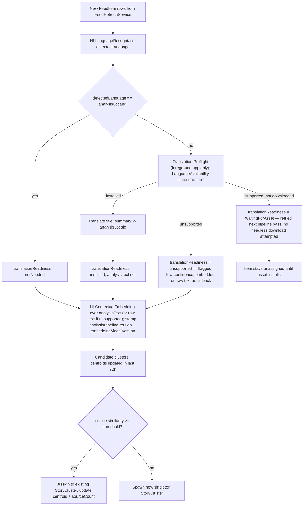

# Sift Story Clustering Architecture (Design Draft v0.1)

**Status:** Draft. Not implementation-ready until the M0 spike (below) passes its exit
criteria. Extends `ARCHITECTURE.md` and `DATA_FLOW.md`, which describe the feed
ingestion pipeline that this design builds on top of unchanged.

**Scope.** This document owns the clustering subsystem only: turning ingested
`FeedItem`s into `StoryCluster`s. It deliberately does **not** define briefing
generation, notification copy, TTS/podcast output, or any Apple-Intelligence-driven
summarization product. Those are a separate downstream consumer of this subsystem's
output and belong in their own design document (working name:
`SIFT_AI_NEWSROOM_AND_BRIEFING.md`, not yet written). Where this doc mentions
"briefing-worthy," it means only the raw signal this subsystem exposes, not a
scheduling or delivery contract.

## 0. Core Premise

The product's core entity is **`StoryCluster`**, not `FeedItem`. `FeedItem` remains
the raw, effectively immutable ingestion unit (one row per publisher's article,
produced exactly as today by `FeedParser` + `FeedRefreshService`), but it is no
longer the primary thing a user reads. A `StoryCluster` groups the `FeedItem`s —
possibly from different feeds and different languages — that report the same
underlying story, and is what the article list is built around going forward.

This reframes the app from "a list of feeds, each with items" to "a list of stories,
each with sources."

## 1. Domain Model

Two additions to the existing SwiftData schema (`Feed`, `FeedItem` in
`Sift/Models/`), plus new fields on both.

```swift
@Model
public final class StoryCluster {
    @Attribute(.unique) public var id: UUID
    public var canonicalTitle: String        // copied from representativeItem.title verbatim — never translated
    public var summary: String?              // extractive, picked from the member nearest the centroid
    public var firstSeenDate: Date
    public var lastUpdatedDate: Date
    public var sourceCount: Int              // distinct publishers among current members — recomputed on every membership change, not time-dependent
    public var languages: [String]           // BCP-47 tags observed among members
    public var centroid: [Float]             // running mean embedding, in analysis-locale space
    public var representativeItem: FeedItem?  // drives display title/artwork/primary link

    @Relationship(deleteRule: .nullify, inverse: \FeedItem.storyCluster)
    public var members: [FeedItem]
}
```

New `FeedItem` fields:

```swift
public var storyCluster: StoryCluster?
public var detectedLanguage: String?           // BCP-47, from NLLanguageRecognizer
public var analysisText: String?               // title+summary translated into the pivot locale — internal only, never rendered
public var embedding: [Float]?
public var clusterAssignmentAttemptedAt: Date?

// Derived-data provenance — required to know which rows must be recomputed
// when the pipeline changes (see §5, M3).
public var analysisLocale: String?             // pivot locale actually used for this item, recorded per-row since the global default can change over time
public var analysisPipelineVersion: Int?
public var embeddingModelVersion: Int?
public var translationReadiness: TranslationReadiness?
```

```swift
public enum TranslationReadiness: String, Codable {
    case notNeeded        // detectedLanguage == analysisLocale, no translation required
    case installed        // pairing was ready; analysisText was produced
    case waitingForAsset  // pairing is supported but the on-device model isn't downloaded yet
    case unsupported      // pairing is not supported at all — falls back to un-pivoted embedding, flagged low-confidence
}
```

New `Feed` field:

```swift
public var publisherKey: String   // registrable domain of siteURL (fallback: url host), e.g. "arstechnica.com" — used to count distinct *publishers*, not distinct feeds, when several feeds (News/Tech/Breaking) come from the same site
```

### Fix: deletion semantics (was `.cascade`, is now `.nullify`)

`StoryCluster.members` must **not** cascade-delete. A `StoryCluster` is a derived,
disposable grouping — it can be deleted and rebuilt at will (pipeline version bump,
bad-cluster cleanup, etc.) and that must never take the underlying raw `FeedItem`
rows with it. `.nullify` means deleting a `StoryCluster` only clears
`FeedItem.storyCluster` back to `nil`, leaving the ingested article intact and
eligible for reassignment on the next pipeline pass. `Feed`'s existing `.cascade`
toward its own `FeedItem`s is unrelated and unchanged — deleting a feed the user
removed should still delete its articles.

### Migration note

`PersistenceController` currently builds `Schema([Feed.self, FeedItem.self])` with no
versioned migration plan. Adding `StoryCluster`, the new `FeedItem` fields, and
`Feed.publisherKey` is the first schema change this project has needed — M1 must
introduce a `SchemaMigrationPlan` (lightweight migration is sufficient; all new
fields are optional/defaulted) rather than relying on SwiftData's implicit
best-effort migration, since that's the only path that's inspectable and testable.

### UI note

`ArticleListView` becomes StoryCluster-primary (one row per story, expandable to its
member sources). The existing per-feed list is kept as a "By Feed" view for users who
disable clustering or want the old behavior — this is a toggle, not a removed
capability.

## 2. Clustering Pipeline

Runs as an actor (same shape as `FeedRefreshService`), invoked after every ingestion
batch — from the foreground app, from the iOS `BGAppRefreshTask` handler, and from
`SiftAgent.app` (§3).



Key decisions:

- **Common analysis locale (point 3).** Every `FeedItem`, regardless of source
  language, is normalized into one pivot language (`analysisLocale`, default `en`, a
  fixed global setting for v0 — not per-user) *before* embedding. Embedding spaces
  are not reliably aligned across languages, and simple lexical signals (shared named
  entities, TF-IDF overlap) that we want as a cheap first-pass filter only work when
  both sides are in the same language. `analysisText` is stored separately from
  `title`/`summary` precisely so translation quality never touches what the user
  reads.
- **Translation asset provisioning is a foreground-only concern (fix 3).**
  Apple's Translation framework distinguishes a language pair being *supported*
  from actually being *installed* on-device; installing an uninstalled pairing can
  require user-facing download consent. `SiftAgent.app` runs headless and must never
  attempt to trigger that UI. Instead, the main app runs a **Translation Preflight**
  step whenever it's foregrounded: it looks at the languages actually seen across the
  user's feeds, diffs them against `analysisLocale`, and — while the user is present
  — prepares/downloads the needed pairings. `SiftAgent.app` only ever consumes items
  already `.installed`; anything still `.waitingForAsset` is simply retried on the
  next pipeline pass rather than blocking or erroring.
- **Bounded candidate set.** New items are only compared against clusters updated in
  the last 72h, not the full corpus — keeps assignment O(recent clusters), not
  O(history).
- **Centroid drift control.** Centroid is a running mean weighted toward recent
  members (or recomputed from the top-K freshest members) so a cluster doesn't
  ossify around its oldest items.
- **Distinct-publisher counting, not distinct-feed counting (fix 5b).** `sourceCount`
  counts distinct `Feed.publisherKey` values among current members, not distinct
  `Feed.id`s — three feeds from the same outlet (News/Technology/Breaking) must not
  look like three independent corroborating sources.
- **Derived-data versioning (fix 6).** `analysisLocale`, `analysisPipelineVersion`,
  and `embeddingModelVersion` are stamped on every `FeedItem` when its
  `analysisText`/`embedding` are computed. This is the only reliable way to know,
  after a threshold/model/pivot change, exactly which rows are stale and need
  reclustering rather than reprocessing the entire corpus blindly.
- **Summary generation.** Extractive only for v0: the sentence from the member
  nearest the centroid with the richest `extractedArticle`. Generative/LLM
  summarization is out of scope for this document (see Scope note above).

### The "briefing-worthy" signal is computed, not stored (fix 5a)

Whether a cluster currently qualifies as notable (e.g. "≥2 distinct publishers within
a rolling recency window") is **time-dependent** — it can flip from true to false
purely because a clock advanced, with no write to the row. Persisting it as a stored
`Bool` on `StoryCluster` would silently go stale. This subsystem therefore does not
store an `isBriefingWorthy` field at all; it exposes `sourceCount`, `languages`, and
timestamps, and leaves the recency-windowed "is this notable right now" query to
whatever consumes the cluster (a `BriefingPlanner` or similar, computed at query
time). That consumer and its scheduling contract are out of scope here — see the
Scope note above.

## 3. Background Execution: SiftAgent.app via `SMAppService.loginItem`

Today's background story is two overlapping, partly-redundant mechanisms:

- `LoginItemManager` — `SMAppService.mainApp`, toggles whether *Sift.app itself*
  relaunches at login. Still valid, unrelated to background refresh.
- `LaunchAgentManager` — hand-writes a `launchd` plist to `~/Library/LaunchAgents`
  and shells out to `launchctl load/unload` to run `Sift --background-refresh`
  periodically. Fragile: manual plist bookkeeping, shells out to a CLI tool, doesn't
  track status other than file-existence, and doesn't play well with sandboxing or
  notarization changes over time.

**Point 1 change:** introduce a real second bundle, `SiftAgent.app`, embedded at
`Sift.app/Contents/Library/LoginItems/SiftAgent.app` with its own bundle identifier
(e.g. `io.github.zaryob.sift.Agent`) and `LSUIElement = true` (no Dock icon).

Registered as:

```swift
if #available(macOS 13.0, *) {
    let service = SMAppService.loginItem(identifier: "io.github.zaryob.sift.Agent")
    try service.register()
}
```

### Fix: resolving the scheduling contradiction (fix 2)

`SMAppService.loginItem` registers exactly that — a login item. It gives no
`StartInterval`-style periodic scheduling contract the way a real `launchd` agent
plist does; Apple treats `.loginItem` and `.agent(plistName:)` as distinct service
types with distinct guarantees. Since point 1 fixes `SiftAgent` as an `.app` bundle
(not a plist-only helper), the correct model is a **resident `LSUIElement` helper**,
not a fire-once-and-exit task and not a `launchd`-interval-scheduled process:

- `SiftAgent.app` launches at login and **stays resident** — it does not idle-exit
  after one run.
- It owns its own in-process scheduler: the same bounded `Task` + `Task.sleep` loop
  pattern `BackgroundFeedScheduler` already uses for its in-app timer, running
  ingestion + the clustering pipeline on an interval.
- It observes `NSWorkspace` sleep/wake notifications to suspend its timer during
  system sleep and run an immediate refresh on wake, rather than trying to catch up
  missed intervals.
- **Accepted limitation:** a login item has no `KeepAlive`/crash-restart semantics
  the way a `launchd` agent would. If `SiftAgent.app` is force-quit or crashes, it
  will not restart until the next login. This is a deliberate tradeoff of staying on
  `.loginItem` per point 1, not an oversight — recorded as an accepted risk in §6
  rather than solved by falling back to `SMAppService.agent(plistName:)`.

Its job once running: open the shared SwiftData store through the existing
`group.io.github.zaryob.sift` App Group container, run ingestion + the clustering
pipeline headlessly (using only `.installed` translation pairings, per §2), refresh
`WidgetSnapshotManager`'s JSON snapshot, and post notifications for cluster changes a
downstream consumer flags as relevant.

Status is observable via `service.status` (`.enabled` / `.requiresApproval` /
`.notFound`) instead of inferred from file existence; `.requiresApproval` should
drive a prompt to open System Settings via `SMAppService.openSystemSettingsLoginItems()`.

This fully replaces `LaunchAgentManager` (delete the manual plist writer and the
`launchctl` `Process` shell-outs). `LoginItemManager`'s `.mainApp` toggle is unrelated
and stays as-is — it controls whether the main UI app opens at login, a separate user
preference from whether the background agent runs.

## 4. Cross-Document Principle Carried Forward

This subsystem does not schedule or deliver anything to the user directly, but any
future consumer of `StoryCluster`/`sourceCount` — a briefing, a notification, a
digest — must treat delivery as **best-effort, never exact-time**, the same way
`BackgroundFeedScheduler`'s existing `BGAppRefreshTaskRequest` usage already is (it
only ever sets `earliestBeginDate` as a floor, never a promise). The full scheduling
and notification contract for that downstream product belongs in
`SIFT_AI_NEWSROOM_AND_BRIEFING.md`, not here.

## 5. Milestones

| # | Milestone | Exit Criteria |
|---|---|---|
| **M0** | **Blocking spike** — feasibility gate. Blocks all further milestones. | Throwaway prototype runs the full pipeline (language detect → translation preflight → translate to pivot → embed → cluster) over a hand-collected corpus of ~300–500 real articles spanning ≥3 languages and ≥20 feeds, hand-labeled into "true" story groups. **Metric:** pairwise precision/recall/F1 against the labeled set (explicitly pairwise — same-cluster-pair agreement — not an ambiguous "clustering F1"), reported *alongside and separately from* **false-merge rate** (fraction of true story pairs incorrectly unified into one cluster). False-merge rate is treated as its own gate: for Sift, showing two stories separately is a much smaller failure than silently merging two unrelated events into one. **Go/no-go:** pairwise F1 ≥ 0.75, false-merge rate under a separately agreed low bound, per-item pipeline latency acceptable on representative hardware, and translation pairings reach `.installed` (not merely `.supported`) for the target languages during the spike — `.supported`-but-not-downloaded is not sufficient evidence the pipeline works headlessly. Worth measuring `lowLatency` vs `highFidelity` translation model quality/latency as two separate data points, not a single number. If any bar is missed, M1 does not start — revisit pivoting strategy (e.g. a genuinely multilingual embedding model instead of translate-then-embed) before proceeding. |
| **M1** | Domain & pipeline scaffolding | `StoryCluster` schema + `SchemaMigrationPlan` land (including `Feed.publisherKey` and the `FeedItem` provenance fields); clustering actor runs in shadow mode (no UI change) against production ingestion to gather real precision/latency data without affecting users. |
| **M2** | Product integration | `ArticleListView` becomes StoryCluster-primary with a "By Feed" fallback; `SiftAgent.app` ships via `SMAppService.loginItem` as the resident helper described in §3; Translation Preflight lands in the foreground app. Briefing/notification UX itself is scoped and built against the separate briefing document, not here. |
| **M3** | **Real clustering benchmark gate** — release blocker. | Re-run the M0 benchmark (same pairwise precision/recall/F1 + false-merge-rate metric pair) against a larger, production-like corpus (real user OPML diversity and volume, not the small M0 fixture). This is a **standing regression gate**: re-run on every subsequent change to `embeddingModelVersion`, `analysisPipelineVersion`, the pivot locale, or the similarity threshold, using those version fields to identify exactly which rows are affected rather than reprocessing blindly. |

## 6. Non-Goals and Accepted Risks for v0

- Generative/LLM summarization of clusters, and the briefing/notification/TTS product
  built on top of this subsystem — both explicitly out of scope for this document
  (see Scope note); tracked separately in `SIFT_AI_NEWSROOM_AND_BRIEFING.md`.
- User-facing cluster correction UI (merge/split a bad grouping) — deferred past M3.
- Server-side/cloud clustering — v0 is 100% on-device; revisit only if the M0 spike
  fails outright.
- Per-user analysis-locale personalization — v0 hardcodes one global pivot language;
  revisit only if M0's translation-coverage data shows it's needed.
- **Accepted:** `SiftAgent.app` as a `SMAppService.loginItem` has no crash-restart
  guarantee and will not resume until next login if killed — a deliberate tradeoff of
  point 1's requirement, not something M1–M3 need to solve.
